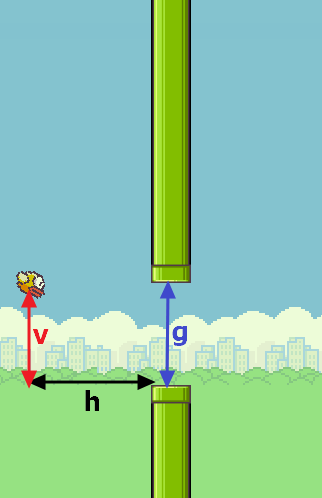
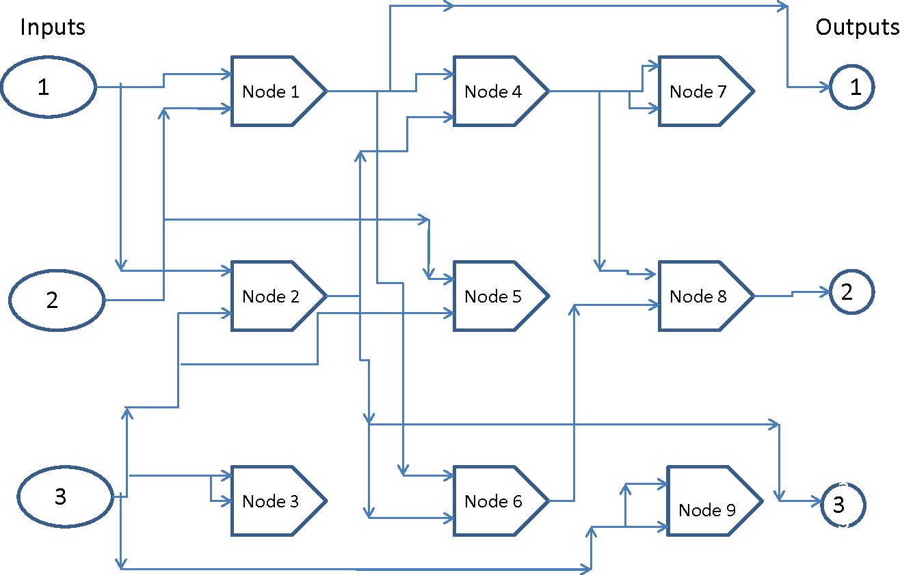
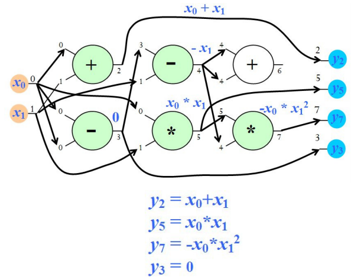
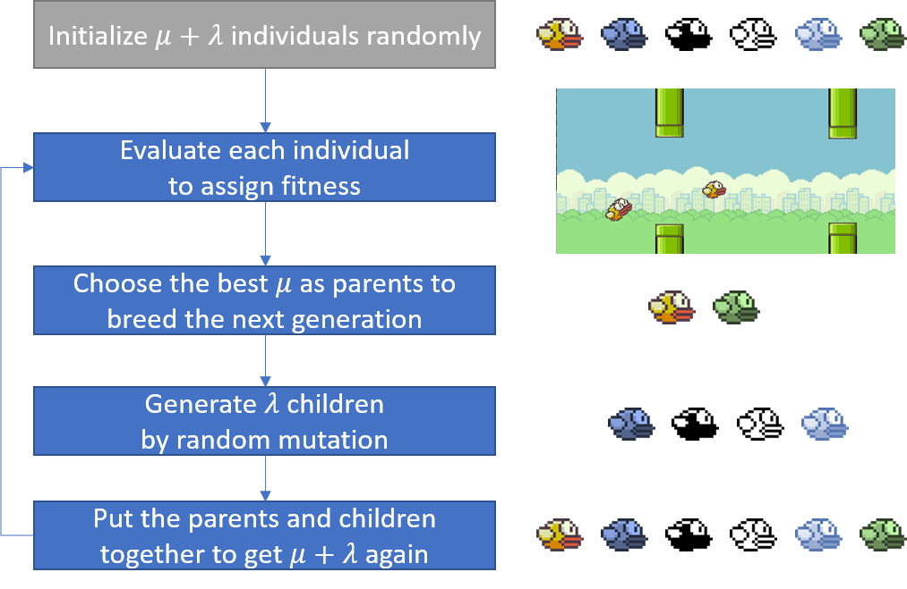

# Learn to Play Flappy Bird using Cartesian Genetic Programming (Evolutionary Computation)
[**NEW**] You can play the flappy bird AI online by repl.it now! Open it and click 'Run'.  (Note repl.it doesn't support sounds yet and thus I have turned them off.)

## Overview

We use cartesian genetic programming (a special form of evolutionary computation) to evolve an AI core to learn to play the *Flappy Bird* game. In brief, the program will learn a math function built with basic arithmetic operators to generate control action based on the current game state. More details about the background, the theory, and some implementation issues are given below. A demo is shown in the following (the blue bird is a human player which can be added at any time.)

## Features

- Compared with other AI flappy bird projects, this game is **more difficult**. Instead of a fixed number, the horizontal distance between adjacent pipes and the gap are all random within a given range.
- With a small population of size 10, it typically takes **less than 50 generations** to get a *proficient* bird who can fly a very, very long distance before death.
- Support adding a human player (a blue bird) at any time to compete with the AI birds.
- No neural networks are involved (if this can count as a feature).
- It is easy to understand and straightforward to implement Cartesian genetic programming. No extra libraries are needed.

## Installation
### Dependencies:
- Python 3.5 or higher
- [pygame](https://www.pygame.org/news).  Install it with `pip install pygame`
### Download this reposity 
`git clone https://github.com/ShuhuaGao/gpFlappyBird`
or download as a zip file directly.
## How to play
### Run the game
First change your directory into the downloaded *gpFlappyBird*. Then, run the game by 
`python main.py`

### Shortcut keys
- <kbd>Ctrl</kbd>+<kbd>H</kbd>: add a human player (a blue bird) at any time

- <kbd>Space</kbd>, or <kbd>UpArrow</kbd>: flap the human player's bird

- <kbd>Ctrl</kbd>+<kbd>P</kbd>: pause/continue game

- <kbd>Ctrl</kbd>+<kbd>M</kbd>: switch ON/OFF sound effect

  If you want to accelerate the evolution process, you can speed up the game by 

- <kbd>Ctrl</kbd>+<kbd>1</kbd>: speed x1

- <kbd>Ctrl</kbd>+<kbd>2</kbd>: speed x2

- <kbd>Ctrl</kbd>+<kbd>3</kbd>: speed x3
## Background

In GitHub, there are many projects aiming to implement artificial intelligence for the *[Flappy Bird](https://en.wikipedia.org/wiki/Flappy_Bird)* game due to its simplicity. This game has only one control action: flap or not. Generally, the algorithms of these projects can be classified into two types. The first depends on neuron evolution, which builds a neural network to map the game state to the control action, and weights of the network are updated using evolutionary algorithms instead of backpropagation, for example, [FlappyLearning](https://github.com/xviniette/FlappyLearning) on GitHub and the [tutorial](https://threads-iiith.quora.com/Neuro-Evolution-with-Flappy-Bird-Genetic-Evolution-on-Neural-Networks) on Quora. The other type focuses on reinforcement learning (RL), typical using a deep Q-Network trained by Q-learning, for example, the [DeepLearningFlappyBird](https://github.com/yenchenlin/DeepLearningFlappyBird) on GitHub. Note that the neuron-evolution based approaches usually gets the internal states like the distance between the bird and the pipe inside the game with some game APIs, while deep RL based methods can accept raw pixels as inputs directly.

In this project, I attempt to develop a *brain* for the flappy bird from another perspective. We know that in other projects, the central neural network is used to learn some function *f* to map the game state *x* to the control action *y*. In the mini game *Flappy Bird*, our intuition is that this mapping should be relatively simple. If so, can we construct the function directly with some basic operations, like {+, -, \*, /}, instead of a neural network approximating this function? As  a programmer, you may try to write a function for this purpose with some physics knowledge, if possible. However, **we want to evolve such a program automatically to control the bird's flap**. Starting here, we will resort to another algorithmic tool, called [genetic programming](https://en.wikipedia.org/wiki/Genetic_programming). 
## Genetic Programming
According to Wiki's definition, it says
> In artificial intelligence, genetic programming (GP) is a technique whereby computer programs are encoded as a set of genes that are then modified (evolved) using an evolutionary algorithm  – it is an application of (for example) genetic algorithms where the space of solutions consists of computer programs.

In short, GP is a special form of [evolutionary computation](https://en.wikipedia.org/wiki/Evolutionary_computation), which can evolve a math expression or, more generally, a computer program, instead of merely parameter values, to optimize some measure. Specifically, in this project, we attempt to evolve a function *f*, which can map the game state *x* to a control action (flap or not) properly.  Though there are many forms of evolutionary computation, they share the same logic, as stated in Wiki,
>In evolutionary computation, an initial set of candidate solutions is generated and iteratively updated. Each new generation is produced by stochastically removing less desired solutions, and introducing small random changes.

### Inputs and output
Unlike the common setting in above mentioned projects, this *FlappyBird* game is more difficult, because the distance between adjacent pipes and the gap between each pair of pipes are random within a given range rather than fixed. Thus, apart from the horizontal distance *h*  and the vertical distance *v* from the bird to the pipe in its front, the pipe gap *g* is also needed in the inputs. In total, the three inputs are shown in the figure below.

Now the function we want to learn (evolve) is *y=f(v, h, g)*. In our application, obviously *f* outputs continuous values if *f* only contains basic arithmetic operators. Therefore, just like any binary classification task, we define the control rule as follows: if *y>0*, then flap; otherwise, do not flap.

Now the remaining question is to implement certain GP to learn *f*. The most commonly used and the oldest representation of the program in GP is to use a tree structure, something similar to a syntax tree, proposed by GP's establisher, John Koza. However, nowadays, there are also several non-tree representations, which is likely to work better than the tree based one. In this project, we use the Cartesian Genetic Programming (CGP) method, which relies on graph representation.
### Cartesian Genetic Programming (CGP)
Cartesian genetic programming is a form of genetic programming, developed by Julian Francis Miller, which uses a graph representation to encode computer programs. It is called ‘Cartesian’ because it represents a program using a two-dimensional grid of nodes. The following figure ([source](https://www.semanticscholar.org/paper/Breast-cancer-detection-using-cartesian-genetic-Ahmad-Khan/b30a33d54637e8323710a4f84973b1d3045c6d3e)) illustrates a CGP graph with 3 inputs, 3 outputs, and 9 computational nodes, which looks like a circuit.

Though it may seem complicated at first sight, the principle is in fact very straightforward to understand. You can find many online tutorials given by Julian F. Miller on CGP , for example the [PPSN 2014 Tutorial](http://cs.ijs.si/ppsn2014/files/slides/ppsn2014-tutorial3-miller.pdf). The figure below in this tutorial gives the general form of CGP.

We first number each computational node (including the input nodes). Then, given an node *f_i*, if it has two input connections labelled *j* and *k*, then it is connected to the two nodes *f_j* and *f_k*, that is, the outputs of the latter two nodes will be consumed by *f_i*. In its standard form, a node's inputs can only be connected to other nodes in previous columns (but not necessarily the adjacent one). We can also specify a *levels-back* parameter to limit the previous columns to which a node can be connected. Besides, one or more output nodes can be specified to produce the final outputs. For example, a functional node is represented by a triple [*g*, *p*, *q*], where *g* is a function, *p* and *q* the input labels. In the most basic version of CGP, evolution is to mutate each *g*, *p*, *q* randomly by certain mutation probability and then evaluate the fitness of the new program encoded by the whole CGP graph.
- Unlike neural networks, a node can connect to any nodes before it (constrained by *levels-back* number). In extreme cases, it may happen that a final output node is connected to the raw input node directly.
- Like neural networks, we can also specify a weight for each input. However, they are not learned by backpropagation, but by random mutations. In this aspect, CGP is also like neuro evolution. 

Note that if a node's output is not fed into another node, then this node is unused in the current graph. In such a sense, CGP in form of  an acyclic direct graph actually encodes a computational graph. However, its charm is that the **functions** themselves and the **topology** of the graph can be changed and improved by evolution according to certain criterion. As a result, though the CGP graph has a fixed number of nodes, the programs (math expressions) it can encode are almost infinite. The following figure from [PPSN 2014 Tutorial](http://cs.ijs.si/ppsn2014/files/slides/ppsn2014-tutorial3-miller.pdf) gives a concrete example of CGP. We notice that the node 6 is not used (termed *inactive* in CGP).

### CGP configuration in this project
#### Function set
A key part in any GP is to specify the function set, i.e., the building blocks of the program we want to evolve. Our prior knowledge can be incorporated here. For example, if you want to evolve a Boolean function, the three basic units {AND, OR, NOT} are required. For the *Flappy Bird* game, I want to make the CGP as simple as possible. Thus, **I only choose the basic arithmetic operators as follows: {+, -, \*, /} and *neg* **, which returns the negated number. You may like to play with other functions!

In this project, we use only 1 row of nodes in the CGP graph. Typically, the number of cols, i.e., the number of computational nodes, is a few hundreds such as 500. Don't be scared of the seemingly large amount of computations. Due to the existence of inactive nodes, which don't participate in computation,I found that  in each generation usually less than 10 percent of the nodes are in fact active. However, such genetic redundancy has been shown to be extremely beneficial to the efficiency of the evolution and is the key to CGP's success. Under our settings, a possible CGP graph in our application may seem like follows.

#### Evolutionary strategy
We usually adopt an [evolution strategy](https://en.wikipedia.org/wiki/Evolution_strategy)(ES) to perform evolution in CGP.  In fact, CGP only specifies the representation of an individual (also called *chromosome* or *genotype*) in evolution, and in theory, you can use any evolutionary algorithm, like the more popular genetic algorithm, to implement evolution. 

In this project, we only use mutation as the single search operator. By mutation, the function and connections in each node can be changed randomly to form a new computational graph. Specifically, a ($\mu$ + $\lambda$) ES is used, where $\lambda$ children compete with their $\mu$ parents together. The working flow of this ES is illustrated below. In current implementation, we set $\mu=2$ and $\lambda=8$.

Interestingly, OpenAI has also a paper titled *Evolution Strategies as a Scalable Alternative to Reinforcement Learning* ([blog](https://blog.openai.com/evolution-strategies/) here).

#### Fitness evaluation
Like any other optimization problem, we need to set up an objective to be optimized. In evolutionary computation, it is usually called *fitness*. In this project, the *fitness* is quantified with the distance the bird has flied.Each bird is assigned a CGP individual, called *brain* in the program, which controls whether the bird should flap according to the output of the function *F(h, v, g)* the CGP graph encodes. If the output is positive, then flap. 

From the demo at the very beginning, we can see that initially the birds just fly blindly. In the next generation, only the two birds with best performance are chosen and used to breed 8 children by mutation. We then let the 10 individuals (including both parents and children) compete again. Repeat this evaluation-mutation process and we can evolve a capable bird after a few generations.

#### Parameter settings
All the game parameters are set in the [settings.py](./settings.py). 

## Reference
[1] Miller, Julian F. "Cartesian genetic programming." Cartesian Genetic Programming. Springer, Berlin, Heidelberg, 2011. 17-34.
[2] Wilson, Dennis G., Sylvain Cussat-Blanc, Hervé Luga, and Julian F. Miller. "Evolving simple programs for playing Atari games." arXiv preprint arXiv:1806.05695 (2018). [Arxiv](https://arxiv.org/abs/1806.05695)

If you are interested in *pygame*, then excellent lessons and tutorials can be found on [KidsCanCode](http://kidscancode.org/lessons/).

